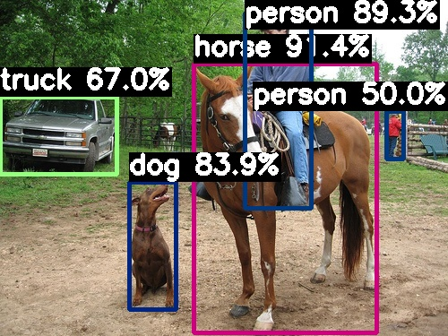

# M4N YOLOv8 检测、分割、姿态模型部署全流程
## 0. 准备环境
```bash
git clone https://github.com/ultralytics/ultralytics.git  # clone
cd ultralytics
pip install -r requirements.txt  # install
pip install -e '.[dev]'  # develop
pip install onnxsim
```
## 1. 修改导出代码并导出模型

[检测模型](./docs/yolov8_native.md)
[分割模型](./docs/yolov8-seg_native.md)
[姿态模型](./docs/yolov8-pose_native.md)

## 2. 准备工具链

<a href="https://pulsar2-docs.readthedocs.io/zh_CN/latest/pulsar2/introduction.html"> 获取工具链 </a>
<a href="https://pan.baidu.com/s/1lVo-HhuF4F4Q79vtMzDXew?pwd=pqo2"> 百度网盘 </a>
<a href="https://drive.google.com/file/d/1-NW7ExBXj5-nTha40iwYshjNJb74Zfer/view?usp=drive_link"> Google Drive </a>

```bash
sudo docker load -i ax_pulsar2_${version}.tar.gz
sudo docker run -it --net host --rm -v $PWD:/data pulsar2:${version}
```

## 3. 转换模型

[检测模型](./docs/yolov8_model.md)
[分割模型](./docs/yolov8-seg_model.md)
[姿态模型](./docs/yolov8-pose_model.md)

## 4. 部署模型
在 models/axmodel/ 目录下找到文件 compiled.axmodel 分别重命名为 （注意每次转换会覆盖之前的模型）

yolov8s.axmodel

yolov8s_seg.axmodel

yolov8s_pose.axmodel

上传至 M4N 开发板 /home/user/models 目录下

### <a href="https://github.com/AXERA-TECH/ax-samples"> ax-samples 部署</a>
在开发板上打开终端，拉取最新的 ax-samples 仓库

安装环境
```shell
sudo apt install git build-essential libopencv-dev cmake
```
拉取仓库
```shell
git clone https://github.com/AXERA-TECH/ax-samples.git
```
进入仓库
```shell
cd ax-samples
```
编译代码
```shell
mkdir build && cd build
cmake -DBSP_MSP_DIR=/soc/ -DAXERA_TARGET_CHIP=ax650 ..
make -j6
make install
```
推理检测模型（分割、姿态模型同理）
```shell
cd install/ax650
sudo ./ax_yolov8 -m /home/user/models/yolov8s.axmodel -i /home/ncy/test.jpg #测试图片自行上传
```
终端输出
```
/home/uers/ax-samples/build/install/ax650/ax_yolov8_native -m /home/user/models/yolov8s.axmodel -i /home/user/horse.jpg
--------------------------------------
model file : /home/user/models/yolov8s.axmodel
image file : /home/user/horse.jpg
img_h, img_w : 640 640
--------------------------------------
Engine creating handle is done.
Engine creating context is done.
Engine get io info is done. 
Engine alloc io is done. 
Engine push input is done. 
--------------------------------------
post process cost time:3.51 ms 
--------------------------------------
Repeat 1 times, avg time 3.67 ms, max_time 3.67 ms, min_time 3.67 ms
--------------------------------------
detection num: 5
17:  91%, [ 216,   71,  421,  373], horse
 0:  89%, [ 273,   14,  349,  233], person
16:  84%, [ 144,  203,  197,  346], dog
 7:  67%, [   0,  108,  131,  195], truck
 0:  50%, [ 431,  124,  450,  178], person
--------------------------------------

Process finished with exit code 0
```
在 build/install 路径下即可找到推理输出图片 yolov8s_out.jpg

### 自定义模型
修改 ax-samples/examples/ax650/ax_yolov8s_native_steps.cc 文件 38 ~ 52 行
```cpp
const int DEFAULT_IMG_H = 640; //模型输入尺寸，与 onnx 输入一致
const int DEFAULT_IMG_W = 640; //同上

const char* CLASS_NAMES[] = {
    "person", "bicycle", "car"}; //检测类别名称，与训练模型 your_model.yaml 中类别名称一致

int NUM_CLASS = 3; //检测类别数量，与训练模型 your_model.yaml 中类别数量一致
```
在 build 目录下重新编译
```shell
cd build
make -j6
make install
```
编译完成即可推理自定义模型
```shell
cd install/ax650
sudo ./ax_yolov8 -m /home/user/models/yolov8s_custom.axmodel -i /home/ncy/test.jpg #测试图片自行上传
```

### <a href="https://github.com/AXERA-TECH/ax-pipeline"> ax-pipeline 部署</a>
(没有安装环境先执行 ax-samples 部署第一歩“安装环境”)

拉取仓库
```shell
git clone https://github.com/AXERA-TECH/ax-pipelines.git
```
进入仓库
```shell
cd ax-samples
git submodule update --init #更新子模块
```
准备其他模块
```shell
mkdir bsp && cd bsp
wget https://github.com/ZHEQIUSHUI/assets/releases/download/ax650/drm.zip
mkdir third-party
unzip drm.zip -d third-party
mkdir -p msp/out
ln -s /soc/* msp/out/
wget https://github.com/ZHEQIUSHUI/assets/releases/download/ax650/sample.zip
unzip sample.zip -d msp
```
编译代码
```shell
mkdir build && cd build
cmake -DAXERA_TARGET_CHIP=AX650 -DBSP_MSP_DIR=$PWD/../bsp/msp/out -DSIPY_BUILD=OFF -DCMAKE_BUILD_TYPE=Release -DCMAKE_INSTALL_PREFIX=install ..
make -j6
make install
```
推理模型（分割、姿态模型同理）

按需修改 /home/user/ax-pipeline/build/install/bin/config/yolov8.json 中注释内容
```json
{
    "MODEL_TYPE": "MT_DET_YOLOV8_NATIVE", #模型类型
    "MODEL_PATH": "/home/user/models/yolov8s.axmodel",#模型路径
    "CLASS_NAMES": [
        "person", #中间类别已省略
        "toothbrush" #模型类别名称
    ],
    "CLASS_NUM": 80, #模型类别数量
    "NMS_THRESHOLD": 0.44999998807907104,
    "PROB_THRESHOLD": 0.4000000059604645
}
```
视频输入推理及 RTSP 推流
```shell
cd install/bin
sudo ./sample_demux_ivps_joint_rtsp -f /home/user/test.mp4 -l 1 -p /home/user/ax-pipeline/build/install/bin/config/yolov8.json
```
终端输出
```
/home/user/ax-pipeline/build/install/bin/sample_demux_ivps_npu_rtsp -f /home/user/sample_1080p_h264.mp4 -l 1 -p /home/user/ax-pipeline/build/install/bin/config/yolov8.json
[N][                            Init][  63]: g_sample Init

[N][                            main][ 154]: sample begin


[I][                            main][ 162]: file input /home/samples/test.mp4
AX_POOL_SetConfig success!
[COMM_SYS][               COMMON_SYS_Init][   99] AX_POOL_Init success!
[I][                            init][ 298]: load model /home/ncy/models/yolov8s.axmodel
Engine creating handle is done.
Engine creating context is done.
Engine get io info is done. 
[I][                            init][ 200]: BGR MODEL
Engine alloc io is done. 
[I][                            main][ 250]: IVPS AI channel width=640 height=640
AX_IVPS_Init
Get pool mem size is 12441632
FramePoolInit successfully! 1
[E][          _venc_get_frame_thread][ 101]: VencChn 0: AX_VENC_GetStream failed!s32Ret:0x80070222

[E][          _venc_get_frame_thread][ 101]: VencChn 0: AX_VENC_GetStream failed!s32Ret:0x80070222

Play URL: rtsp://127.0.0.1:8554/axstream0   seeeisID:2
```

在 VLC 中输入 rtsp://192.168.1.2:8554/axstream0 即可预览推理视频（注意！ IP 地址需改为自己开发板的地址）